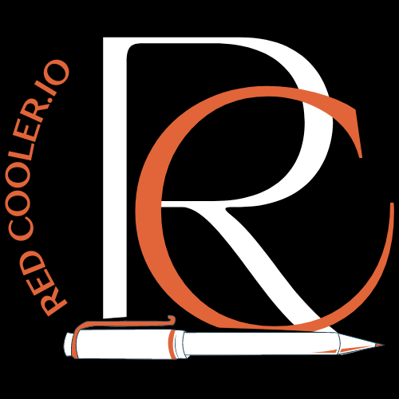

# Redcooler.io

  

Redcooler.io is a vibrant community built for artists, musicians, producers, and writers to collaborate, share projects, and inspire creativity. It provides a platform where users can engage in discussions, post projects, and collaborate on music and writing.

## Features

- **Community Forum**: Engage with a thriving community of artists and creators in a public-facing forum. Discuss ideas, seek feedback, and connect with like-minded individuals.

- **Collaborative Music Projects**: Create posts with links to YouTube videos or SoundCloud songs, and users can contribute by writing lyrics to the music. Users can also upload their own MP3 files for others to write to.

- **Privacy Controls**: Choose between public or private posts. Public posts are viewable by any user, while private posts can be accessed only by the creator and members they add to a list.

- **Real-time Video Streaming**: (Future Feature) Collaborate with other musicians through real-time video streaming sessions. Jam together, exchange ideas, and create amazing music in a seamless virtual environment.

## Live

Check out our live site [here](https://redcooler.io/) to get a feel for Redcooler.io's features and functionalities.

## Technologies Used

- Next.js
- Tailwind CSS
- TypeScript
- Appwrite (Backend Service)

## Deployment

Redcooler.io is deployed to a VPS on DigitalOcean. We utilize PM2 to manage the server processes and NGINX as a reverse proxy.

## Roadmap

We have exciting plans for the future of Redcooler.io. Some upcoming features include:

- Real-time video streaming sessions for musical collaboration.
- Enhanced privacy controls for more granular post visibility settings.
- Integration with

popular music streaming platforms for seamless project sharing.

Stay tuned for more updates!

## Authors

Redcooler.io is maintained by [Andre Gonzales](https://github.com/gibstock) and [Emilio Gonzales](https://github.com/EmilioG1). Reach out to us if you have any questions or feedback.

---
